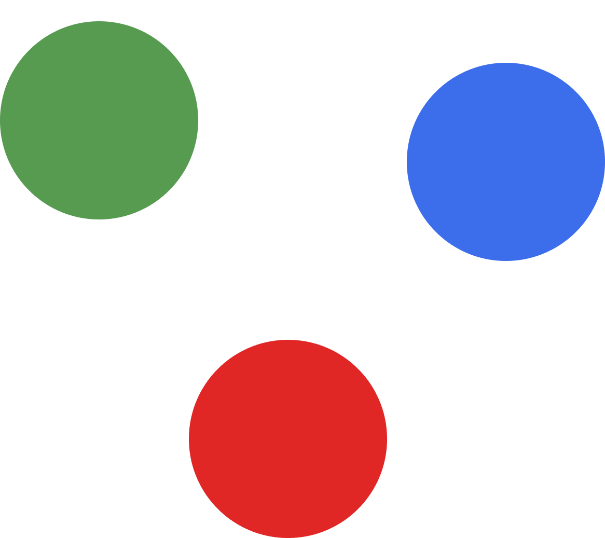

<p align="center">
  
</p>

# micro-frontsystem

Create micro-frontends with easy configurations across your monorepo that you've already set up, otherwise, you can created easy.

Config created in your root project.

This is the straightforward configuration created in the root of your project linking multiple applications once.

```js
//micro.front.js
const { micro } = require("micro-frontsystem");

const { run } = micro({
  apps: {
    homepage: {
      basePath: "/",
      preBuildScript: "build",
      output: "build",
    },
    marketing: {
      basePath: "/marketing",
      preBuildScript: "build",
      output: "build" // default is dist, if this changes, you must update it here as well
    },
    selling: {
      basePath: "/selling",
      preBuildScript: "build",
    },
  },
  port: 8000,
});

run();
```

Let's glance at the frontend structure and how it is ready to build our codebase. You can use the example in the **example package** located inside this repo.

```
├───apps
│   ├───homepage
│   │   ├───build
│   │   ├───src
│   │   └───package.json
│   ├───marketing
│   │   ├───build
│   │   ├───src
│   │   └───package.json
│   └───selling
│   │   ├───dist
│   │   ├───src
│   │   └───package.json
├──micro.front.js
```

```console
node ./micro.front.js
```

You may be wondering how it works, the *micro.front.js* is a server with base dynamic routes. The microfront architecture in this approach was developed using paths. Thus, you'll be able to use whatever framework. In our example we are using React and Vue independently.First app is clearly where the user will navigate a lot, the second React's folder is in charge of the marketing team, and the third of the selling team.

It's worth mentioning, this server runs pretty nice with static pages because its mechanism is serving html or a file.


## API

### apps
Object of applications with their self configs. The key's property references to the folder inside apps.

| name | usage |
-- | --
**basePath** | Specify the entry point path for the applications 
**preBuildScript** | Name of the script that you want to execute before running the server
**output** | Folder where the server will search the static resources. By default it is "dist"

### port
You can specify the port to roll out the applications.

### run
Start the server executing all processes of the property "app" creating proper routes.